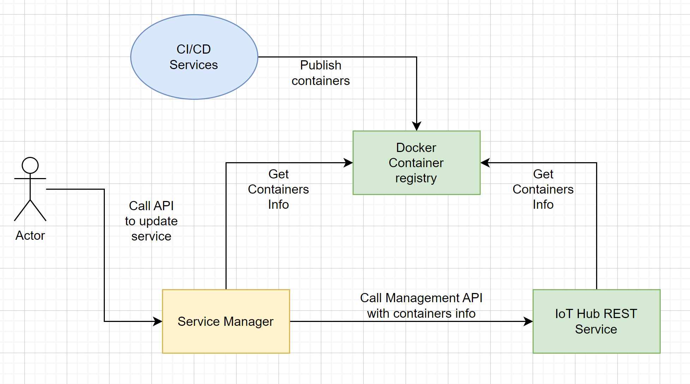

## High Level Design
Docker services update management for IoT devices

###### Description
This document describes high level architecture suggestion for a services management tool using the Azure IoT Hub REST.

#### Design

## Specification
Update Service API

**Route:** {service-manager}/api/devices/{id}

| HTTP Method  |  Parameters |
| ------------ | ------------ |
|   PUT |   Tag |

Create Service API

**Route:** {service-manager}/api/devices/

| HTTP Method  |  Parameters |
| ------------ | ------------ |
|   POST |   Tag |

Remove Service API

**Route:** {service-manager}/api/devices/{id}

| HTTP Method  | 
| ------------ |
|   Delete |    |

